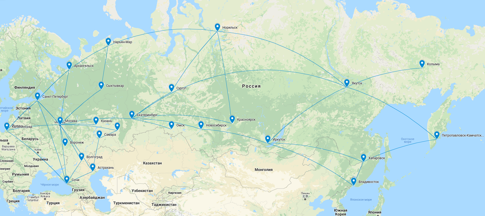

✈ RouteFinder
======

Данный репозиторий создан для отработки практического применения алгоритма depth-search first (DFS) на примере авиасообщения между
городами РФ.


## Содержание:
- [Развёртывание](#install)
- [Цели](#goals)
- [Прогресс выполнения](#progress)
- [Итоги проекта](#features)


## Развёртывание <a name="install"/>
Docker Engine 19.03.0+

Docker Compose 1.27.0+
```Bash
git clone git@github.com:suhanoves/route_finder.git
cd route_finder/
docker-compose up -d
```
Сайт будет доступен по адресу http://localhost:9876


## Цели: <a name="goals"/>
* Создание взвешенного направленного графа городов-миллионников России
* Оценка рёбер графа по двум параметрам: время в пути и стоимость билета
* Используя алгоритм DFS найти:
    * самый быстрый маршрут
    * самый дешёвый маршрут
    * то же самое, но с учётом желаемых городов-пересадок
    * найти маршруты с учётом бюджета заказчика
* Упаковать бэкэнд в приятную глазу оболочку на основе Bootstrap5
* Получить удовольствие 😁

## Прогресс выполнения: <a name="progress"/>
* :heavy_check_mark: Приложения Города (cities), CRUD для модели City
* :heavy_check_mark: Кастомный тэг для подсвечивания активной страницы в header
* :heavy_check_mark: DjangoMessages при CrUD операциях
* :heavy_check_mark: Кастомный тэг для подстановки иконки в bootstrap alerts
* :heavy_check_mark: Приложения Рейсы (flights), CRUD для модели Flight
* :heavy_check_mark: Добавление constraints и метода clean() к модели Flight
* :heavy_check_mark: Создано приложение Маршруты (routes), добавлена форма поиска маршрута
* :heavy_check_mark: Подключены crispy-forms для удобной визуализации форм в стиле bootstrap
* :heavy_check_mark: Создана форма поиска маршрутов с учётом промежуточных городов
* :heavy_check_mark: Подключена JQuery библиотека select2 для удобных полей поиска select и multiply select
* :heavy_check_mark: Реализована функция конвертирующая представление графа из списка рёбер в списки смежных вершин с учётом весов
* :heavy_check_mark: Воплощён в коде алгоритм DFS в виде генератора, обеспечивающий поиск всех маршрутов из пункта назначения в пункт прибытия
* :heavy_check_mark: Добавлены фильтры найденных маршрутов по промежуточным городам, стоимости и времени в пути при помощи ФВП
* :heavy_check_mark: Свертсан базовый шаблон для вывода маршрутов и рейсов из которых маршрут состоит
